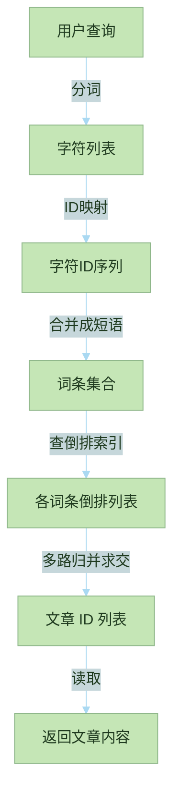

# Sylph  

```text
   _____       __      __  
  / ___/__  __/ /___  / /_ 
  \__ \/ / / / / __ \/ __ \
 ___/ / /_/ / / /_/ / / / /
/____/\__, /_/ .___/_/ /_/ 
     /____/ /_/            
```

## 说明

Sylph 是一个实验性的数据库, 用于验证我自己的一些架构设计想法, 还在开发中.  

本项目以学习和探索为主要目的, 未经严格的正确性检查与性能优化, 不适合在生产环境使用.

本项目采用 [MIT License](LICENSE) 进行许可.  

## 设计概览

### 核心流程


