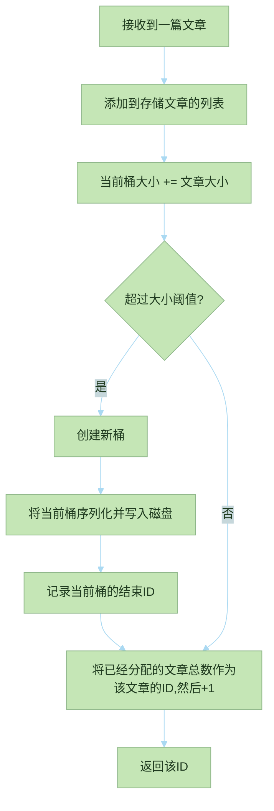
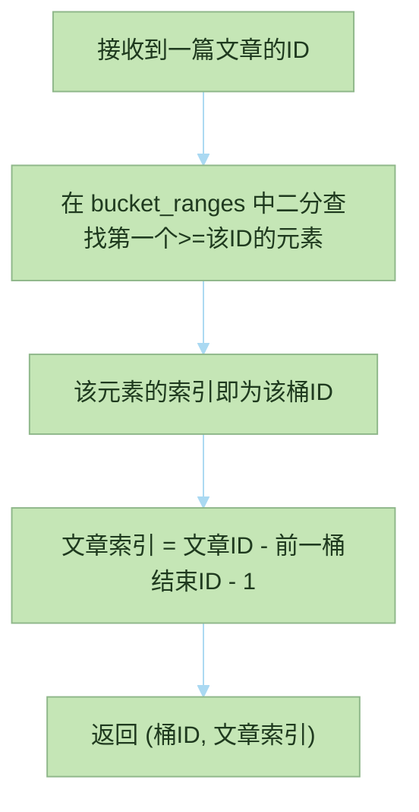

# 文档桶相关内容说明

[add_doc](#add_doc)  
[bucket_ranges](#bucket_ranges)  
[get_index](#get_index)  

说明:  
文档桶: 在内存中累积多篇文章, 达到设定大小后整体写入磁盘的缓冲区.  

## add_doc

该函数接收一篇文章,添加到文档桶.  
如果桶的大小达到阈值,创建新桶并写入旧内容到磁盘.  

输入:  

```text
doc: "Sylph 是一个...(待索引的文章)" // 该字符串的大小为38
&mut self: DocBucket { id: 0, total_size: 67108826, content }
&mut config: DocBucketConfig {
    bucket_ranges: [],
    threshold: 67108864,   // 64MB
    article_count: 67100,
    path: "/var/lib/sylph/buckets"
}
```

输出:  

```text
67100
```

变化的量:  

```text
&mut self: DocBucket { id: 1, total_size: 0, content: [] }
&mut config: DocBucketConfig {
    bucket_ranges: [67100],
    threshold: 67108864,
    article_count: 67101,
    path: "/var/lib/sylph/buckets"
}
```

处理流程:  



## bucket_ranges

每个已刷盘桶的结束ID(即最后一篇文章的ID)的列表, 按刷盘顺序排列.  

假设有三个桶,其中的文章用其ID表示

```text
[0, 1, 2, 3]    // 桶0
[4, 5, 6, 7, 8] // 桶1
[9, 10, 11]     // 桶2(未刷盘)
```

那么对应的bucket_ranges为:  

```text
[3, 8]
```

其中, "3"是桶0的结束ID, "8"是桶1的结束ID.
桶2还未刷盘, 所以当前结束ID是"11", 列表中却没有.  

## get_index

该函数接收一个文章的ID, 然后返回一个元组 (桶的ID, 文章在桶内的索引).  

原理:  
对于给定的文章ID, 它一定落在某个桶的范围内. 因为桶的范围是连续的, 且结束ID是递增的,  
所以第一个 >= 文章ID 的结束ID所在的桶就是包含该文章的桶.  

示例: 对于[bucket_ranges](#bucket_ranges)中的情况,  
若文章ID=6, 第一个 >= 6 的结束ID是8, 在bucket_ranges中的索引为1，所以桶ID=1.  

文章在桶内的索引 = 文章ID - 桶内第一篇文章的ID.  
对于非首桶, 桶内第一篇文章的ID = 前一个桶的结束ID + 1,  
所以文章索引 = 文章ID - 前一个桶的结束ID - 1.

对于首桶, 前一个桶的结束ID视为 -1, 则索引 = 文章ID - (-1 + 1) = 文章ID,  
所以直接用ID作为索引.  

示例:  
输入:  

```text
&self {
    bucket_ranges: [30000,67100],
    threshold: 67108864,   // 64MB
    article_count: 67101,
    path: "/var/lib/sylph/buckets"
}
article_id: 67100
```

输出:  

```text
(1,37099)
```

处理流程:  


