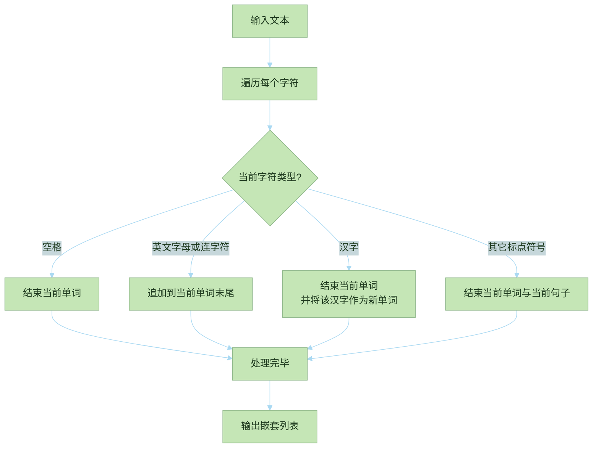
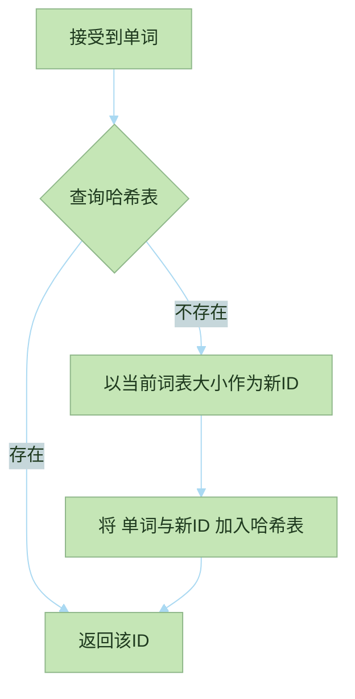
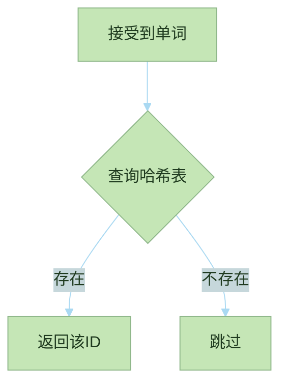
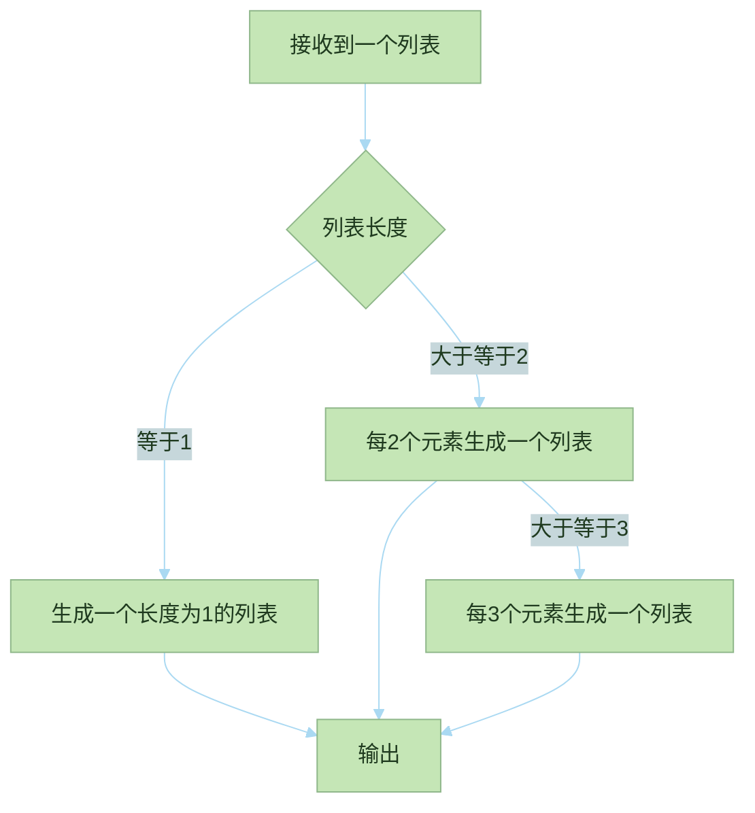

# 介绍分词器相关函数

代码文件[tokenizer.rs](../src/tokenizer.rs)  

## split_into_sentences

该函数将一段文本按标点拆分为句子,  
再将每个句子拆分成单词或单个汉字.  

输入:  

```text
&"Sylph 是一个"实验性"的Database‌, 用于验证我自己的一些架构设计想法."
```  

得到以下嵌套列表:

```text
[
    ["Sylph", "是", "一", "个"],
    ["实", "验", "性"],
    ["的", "Database"],
    ["用", "于", "验", "证", "我", "自", "己", 
    "的", "一", "些", "架", "构", "设", "计", "想", "法"]
]
```

处理流程:  



## assign_ids

该函数维护一个全局哈希表(AHashMap<String, u32>),  
将 split_into_sentences 产出的每个单词映射为一个唯一的整数ID.  
若单词不存在则为其分配新 ID(当前词表大小) 并加入哈希表.  

输入:  

```text
id_map: &mut {
    "是": 100,
    "Database": 101
}
len: &mut 2
context: [ 
    ["Sylph", "是", "一", "个"],
    ["实", "验", "性"],
    ["的", "Database"],
]
```

输出:  

```text
[[2, 100, 3, 4], [5, 6, 7], [8, 101]]
```

核心处理流程:  



## lookup_ids

该函数接受一个全局哈希表(AHashMap<String, u32>),  
将 split_into_sentences 产出的每个单词映射为一个唯一的整数ID.  
若单词不存在则跳过, 如果一行中所有单词都不在词表中, 则跳过该行, 不会在结果中产生空列表.  

输入:  

```text
id_map: &{
    "是": 100,
    "Database": 101
}
context: [ 
    ["Sylph", "是", "一", "个"],
    ["实", "验", "性"],
    ["的", "Database"],
]
```

输出:  

```text
[[100], [101]]
```

核心处理流程:  



## generate_ngrams

该函数接受 assign_ids 输出的 ID 列表, 生产2-gram和3-gram,  
如果长度不够可能只生成1gram或2gram.  

输入:  

```text
[[1], [2, 100, 3, 4], [5, 6, 7], [8, 101]]
```

输出:

```text
[
    [1],
    [2, 100],
    [100, 3],
    [3, 4],
    [2, 100, 3],
    [100, 3, 4],
    [5, 6],
    [6, 7],
    [5, 6, 7],
    [8, 101]
]
```

核心处理流程:  


